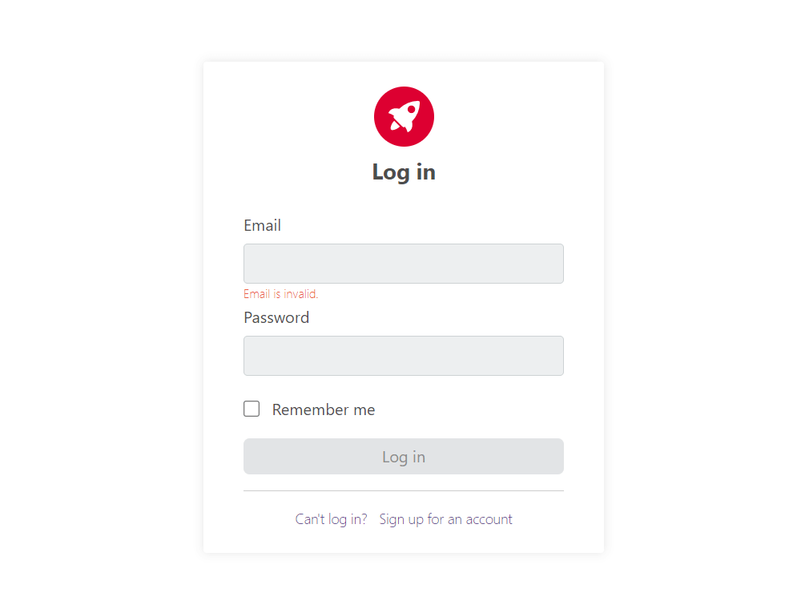
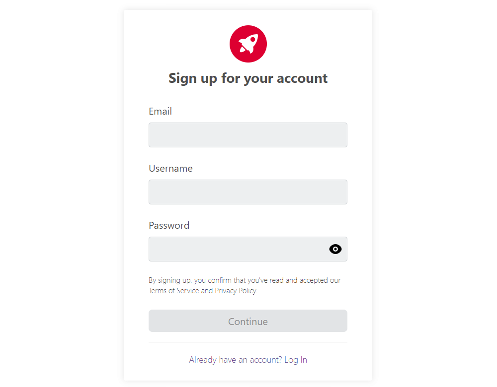
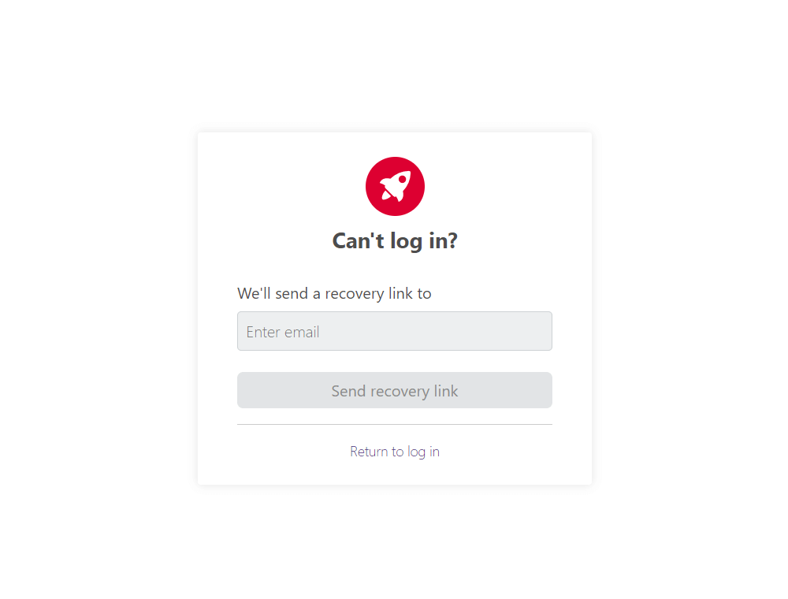
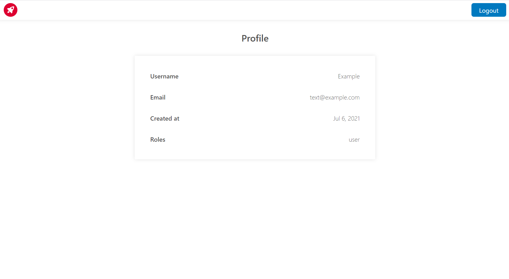

# NestJS and Angular authentication

<blockquote>
  The simple application JWT authentication with frontend and backend.
</blockquote>

Demo link on fake backend.

[Live Demo](https://malvdev.github.io/nestjs-angular-auth/)

## Contents

- [Motivation](#Motivation)
- [Features](#Features)
- [Technologies](#Technologies)
- [Configuration](#Configuration)
- [Instalation](#Instalation)
- [Media](#Media)

## Motivation

I wanted to create a simple application using JWT authentication with frontend on `Angular` and backend on` NestJS`, in order to understand how JSON Web Token (JWT) works, as well as to pump my skills in `Angular` and `NestJS`.

## Features

- User registration.
- User login.
- Forgotten password recovery.
- Profile page.

## Technologies

- Angular2+
- NestJS
- TypeScript
- JSON Web Token (JWT)
- Docker
- MySQL

## Configuration

Environment configuration in `.env`file.

## Instalation

1. Have [Node.js](https://nodejs.org/en/) and [Docker](https://www.docker.com/) installed.
1. Clone the project.
1. Go to the project's folder and run `npm install` to install dependencies.
1. Run `npm run start` to start the app. Browse `Swagger Open API` Doc at [http://localhost:3000/docs](http://localhost:3000/docs) and `App` at [http://localhost:4200/](http://localhost:4200/)
1. Run `npm run stop` to stop the app.

## Media

  
  
  
  

