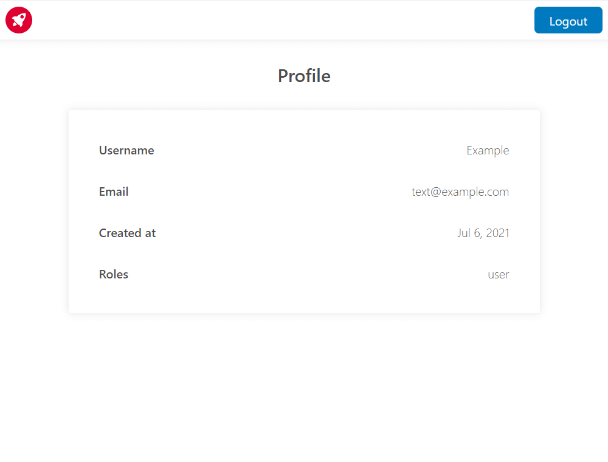

# NestJS and Angular authentication

Simple application with authentication.

## Running the app

```bash
npm run init
```

```bash
npm run start:api
```

```bash
npm run start:web
```

## Screenshots



